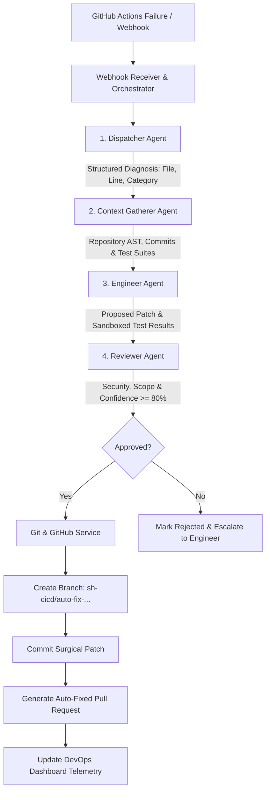

# SH-CICD: Self-Healing Continuous Integration and Continuous Deployment using Multi-Agent AI

[](https://www.python.org/downloads/)
[](https://flask.palletsprojects.com/)
[](LICENSE)
[](https://github.com/features/actions)

An autonomous multi-agent AI system that intercepts build and test failures in GitHub Actions CI/CD pipelines, diagnoses error logs, extracts repository context, synthesizes minimal code repairs, conducts pre-submission validation tests, executes security and quality reviews, and creates Auto-Fixed Pull Requests on GitHub without human intervention.

---

## 1. Project Overview & Objective

Continuous Integration and Continuous Deployment (CI/CD) pipelines frequently fail due to minor syntax discrepancies, unhandled runtime conditions, dependency mismatches, and regression errors. Investigating logs, identifying offending source code, writing patches, and opening pull requests consumes substantial engineering hours.

**SH-CICD** introduces a self-healing software delivery pipeline powered by four cooperative, role-specialized AI agents:
1. **Dispatcher Agent:** Detects pipeline failures, parses raw execution logs, and classifies the failure category.
2. **Context Gatherer Agent:** Interacts with the repository to retrieve source files, AST structures, recent commits, and test suites.
3. **Engineer Agent:** Diagnoses root causes, crafts localized minimal code patches, and runs sandboxed pre-submission unit tests.
4. **Reviewer Agent:** Performs automated security checks, ensures zero scope creep, evaluates confidence, and opens Auto-Fixed Pull Requests on GitHub.

---

## 2. System Architecture & Multi-Agent Flow



---

## 3. Project Directory Structure

```
sh-cicd/
│
├── app.py                     # Flask web server, page routes & REST APIs
├── requirements.txt           # Python dependency specifications
├── README.md                  # Complete documentation, demo guide & viva Q&A
├── .env.example               # Environment configuration template
├── .env                       # Local environment configuration
├── test_pipeline.py           # Multi-agent end-to-end unit test suite
├── test_routes.py             # Flask route and API endpoint test suite
│
├── agents/                    # Multi-Agent Core Engine
│   ├── __init__.py
│   ├── dispatcher.py          # Log analysis & failure classification agent
│   ├── context_gatherer.py    # GitHub repo context & AST inspection agent
│   ├── engineer.py            # Code remediation & test validation agent
│   └── reviewer.py            # Security audit & Auto-PR dispatch agent
│
├── services/                  # Supporting Infrastructure Services
│   ├── __init__.py
│   ├── github_service.py      # GitHub REST API client + Mock Demo mode
│   ├── ai_service.py          # Google Gemini / OpenAI / Offline Heuristic Engine
│   ├── webhook_service.py     # HMAC-SHA256 signature verification & event parsing
│   ├── test_service.py        # Sandboxed AST compilation & unit test runner
│   └── orchestrator.py        # Sequential 4-agent workflow coordinator
│
├── database/                  # Data Access & Storage Layer
│   ├── __init__.py
│   ├── database.py            # SQLite connection manager, schema & seed records
│   ├── models.py              # Queries for failures, agents, PRs, logs & settings
│   └── sh_cicd.db             # Local SQLite database
│
├── templates/                 # Frontend Jinja2 HTML Templates
│   ├── base.html              # Master layout with modern dark sidebar & modals
│   ├── index.html             # Landing page with hero animation & feature overview
│   ├── dashboard.html         # Real-time command center, workflow stepper & telemetry
│   ├── failures.html          # CI/CD failure incidents table & inspection modal
│   ├── agents.html            # AI agent fleet cards, latencies & live logs
│   ├── analytics.html         # Chart.js telemetry (trends, categories, MTTR)
│   ├── pullrequests.html      # Tracked pull requests & unified diff viewer
│   └── settings.html          # Configuration UI for GitHub tokens & AI providers
│
├── static/                    # Frontend Static Assets
│   ├── css/
│   │   └── style.css          # DevOps dark theme (Poppins, glassmorphism, animations)
│   └── js/
│       ├── main.js            # Modals, toasts, and UI helpers
│       ├── dashboard.js       # Live simulation controller, stepper & mini-charts
│       └── analytics.js       # Chart.js configuration scripts
│
├── demo_repo/                 # Standalone Demo Codebase for Offline Testing
│   ├── calculator.py          # Sample module subject to pipeline checks
│   └── test_calculator.py     # Unit test suite verifying calculations
│
└── .github/
    └── workflows/
        └── test.yml           # Sample GitHub Actions CI workflow configuration
```

---

## 4. Technology Stack

- **Backend Framework:** Python 3.10+ with Flask
- **Multi-Agent AI Engine:** Python modular agent architecture
- **AI / LLM Integration:** Google Gemini API / OpenAI API / Built-in Offline Heuristic Repair Engine
- **Database:** SQLite3 with relational foreign keys
- **CI/CD Platform:** GitHub Actions
- **API Protocol:** GitHub REST API v3
- **Frontend:** HTML5, Modern CSS3 (Cyber Dark DevOps Theme), JavaScript (ES6)
- **Data Visualizations:** Chart.js 4.4
- **Iconography:** Font Awesome 6.5
- **Typography:** Google Fonts (Poppins & JetBrains Mono)

---

## 5. Step-by-Step Installation & Setup Guide

### Prerequisites
- Windows 10/11, macOS, or Linux
- Python 3.10 or higher installed
- Visual Studio Code (or any IDE)
- Git installed (optional for demo mode)

### Step 1: Open Project in VS Code
Open terminal (PowerShell or Bash) and navigate to the project directory:
```powershell
cd C:\Users\Admin\.gemini\antigravity\scratch\sh-cicd
code .
```

### Step 2: Create and Activate a Python Virtual Environment
```powershell
# Create virtual environment named 'venv'
python -m venv venv

# Activate on Windows (PowerShell)
venv\Scripts\Activate.ps1
# (Or in Command Prompt: venv\Scripts\activate.bat)
# (Or on macOS/Linux: source venv/bin/activate)
```

### Step 3: Install Required Dependencies
```powershell
python -m pip install --upgrade pip
python -m pip install -r requirements.txt
```

### Step 4: Configure Environment Variables
Copy `.env.example` to `.env` (pre-configured with safe demo defaults):
```powershell
Copy-Item .env.example .env
```

The system includes a zero-cost **Demo Mode** enabled by default (`DEMO_MODE=true` and `AI_PROVIDER=demo`). No paid API keys or GitHub tokens are required to run a full demonstration.

### Step 5: Initialize Database & Run Automated Tests
```powershell
# Run the end-to-end agent verification suite
python test_pipeline.py

# Run the Flask routes and API verification suite
python test_routes.py
```
Both test suites will report `OK`.

### Step 6: Start the Flask Application
```powershell
python app.py
```

Output:
```
=================================================================
 🚀 SH-CICD: Self-Healing CI/CD Multi-Agent AI System
 🌐 Access Dashboard at: http://127.0.0.1:5000
=================================================================
 * Running on http://127.0.0.1:5000
```

Open your browser and navigate to: **`http://127.0.0.1:5000`**

---

## 6. Detailed AI Agent Architecture

### Agent 1: Dispatcher Agent (`agents/dispatcher.py`)
- **Primary Responsibility:** Log parsing, error extraction, and categorization.
- **Workflow:**
  1. Intercepts raw console output emitted by the failed CI/CD job step.
  2. Executes regular-expression and AST traceback patterns to locate failing files and line numbers.
  3. Classifies the error into one of six standard DevOps categories: `syntax`, `dependency`, `testing`, `runtime`, `configuration`, or `build`.
  4. Generates a normalized diagnosis dictionary containing `failing_file`, `line_number`, `error_type`, and `summary`.
  5. Updates agent telemetry and logs action in the SQLite database.

### Agent 2: Context Gatherer Agent (`agents/context_gatherer.py`)
- **Primary Responsibility:** Repository intelligence and environment discovery.
- **Workflow:**
  1. Queries the target repository through the GitHub REST API (`GET /repos/{owner}/{repo}/contents/{path}`).
  2. Retrieves full source code and commit SHA of the failing file.
  3. Discovers associated unit test files (e.g., `test_<filename>.py`).
  4. Inspects dependency specifications (`requirements.txt`, `package.json`, etc.).
  5. Retrieves the latest 3 commit diffs to isolate recent developer changes.
  6. Bundles this codebase context to prevent LLM context-window truncation.

### Agent 3: Engineer Agent (`agents/engineer.py`)
- **Primary Responsibility:** Root-cause analysis, surgical patch creation, and pre-test validation.
- **Workflow:**
  1. Correlates the diagnosed error with the codebase context.
  2. Generates a minimal surgical fix that alters only the offending lines.
  3. Computes a GitHub-compliant unified git diff (`--- a/file +++ b/file`).
  4. Deploys the patched code into an isolated temporary execution directory.
  5. Executes `python -m unittest` against the patched code inside the sandbox.
  6. Passes the patch and verified test execution output to the Reviewer Agent.

### Agent 4: Reviewer Agent (`agents/reviewer.py`)
- **Primary Responsibility:** Security audit, scope containment, quality gate, and PR creation.
- **Workflow:**
  1. Audits patched code for dangerous commands (`os.system`, `subprocess.Popen`, `eval`, `rmtree`, credential exposure).
  2. Checks for scope creep (rejects fixes modifying excessive unrelated code lines).
  3. Verifies that pre-submission unit tests passed with 100% success.
  4. Calculates an automated confidence score ($0-100\%$).
  5. If confidence $\ge 80\%$, approves the fix and triggers the `GitHubService`:
     - Creates git branch `sh-cicd/auto-fix-issue-<id>-<rand>`
     - Commits the modified file
     - Creates an Auto-Fixed Pull Request on GitHub
  6. If rejected, updates incident status to `FAILED` and records recommendations for manual engineering review.

---

## 7. How GitHub Actions & Webhooks Connect to the System

### 1. GitHub Actions Workflow Configuration
In your repository's `.github/workflows/test.yml`:
```yaml
name: Python CI Suite
on: [push, pull_request]

jobs:
  build-and-test:
    runs-on: ubuntu-latest
    steps:
      - uses: actions/checkout@v4
      - uses: actions/setup-python@v5
        with:
          python-version: "3.11"
      - run: pip install -r requirements.txt
      - run: python -m py_compile demo_repo/calculator.py
      - run: python -m unittest discover -s demo_repo -p "test_*.py"

      # Notify SH-CICD Webhook on failure
      - name: Trigger Self-Healing
        if: failure()
        env:
          WEBHOOK_URL: ${{ secrets.SH_CICD_WEBHOOK_URL }}
        run: |
          curl -X POST "$WEBHOOK_URL" \
            -H "Content-Type: application/json" \
            -d "{\"repository\": \"${{ github.repository }}\", \"workflow\": \"${{ github.workflow }}\", \"run_id\": \"${{ github.run_id }}\", \"status\": \"failed\"}"
```

### 2. GitHub Webhook Delivery
- Go to repository **Settings &rarr; Webhooks &rarr; Add Webhook**.
- Payload URL: `http://<your-server-or-ngrok-domain>/webhook/github`
- Content type: `application/json`
- Secret: `<your_webhook_secret>`
- Events: Select **Workflow runs** or **Check runs**.
- When any job fails, GitHub delivers a signed HMAC-SHA256 payload to `/webhook/github`.

---

## 8. Complete Demonstration Procedure (For Presentation & Viva)

### Step 1: Launch Dashboard
1. Start `python app.py` and open `http://127.0.0.1:5000`.
2. Present the **Landing Page** (`/`), explaining the problem of developer interruption and broken CI pipelines.
3. Click **"Launch Dashboard"** to enter the DevOps Command Center (`/dashboard`).

### Step 2: Show Baseline Dashboard State
1. Point out the four key metric cards: Total Failures, Fixed Failures, Open Failures, Auto-Fixed PRs.
2. Explain the **Self-Healing Multi-Agent Pipeline Workflow** stepper diagram.
3. Show the **Agent Fleet Status** card displaying all 4 agents in `IDLE` state.

### Step 3: Trigger a Live Failure Simulation
1. Click the **"Simulate CI Failure"** button in the header.
2. Select **Scenario 1: SyntaxError (Missing ':')**.
3. Point out the raw CI/CD error log:
   ```
   File "demo_repo/calculator.py", line 4
       def add(a, b)
                    ^
   SyntaxError: expected ':'
   ```
4. Click **"Run Multi-Agent Healing"**.

### Step 4: Observe Real-Time Agent Execution
1. Watch the workflow stepper animate live:
   - **Dispatcher** turns active: analyzes error, extracts file `calculator.py` and line `4`.
   - **Context Gatherer** turns active: fetches repository code and test suite `test_calculator.py`.
   - **Engineer** turns active: patches `def add(a, b):`, executes sandboxed unit tests.
   - **Reviewer** turns active: verifies zero security vulnerabilities, approves fix with 98.5% confidence.
2. Observe the toast notification: `"Fix Approved! Created Auto-Fixed PR #... "`
3. The page refreshes, incrementing fixed failures and listing the new PR.

### Step 5: Inspect the Auto-Fixed Pull Request
1. Click **"Auto-Fixed PRs"** in the sidebar (`/pullrequests`).
2. Click the **"Diff"** button to open the unified diff viewer.
3. Show the clean patch:
   ```diff
   --- a/calculator.py
   +++ b/calculator.py
   @@ -3,3 +3,3 @@
   -def add(a, b)
   +def add(a, b):
        return a + b
   ```

### Step 6: Explore Analytics & Agent Telemetry
1. Open **"Analytics"** (`/analytics`): show Chart.js failure categories, remediation rates, and agent latencies.
2. Open **"AI Agents"** (`/agents`): show the task completion count, average execution time (< 1 second), and full audit trail in the agent logs table.

---

## 9. Final-Year CSE Viva Questions & Comprehensive Answers

### Q1: What is the primary objective of the SH-CICD project?
**Answer:** The objective is to build an autonomous self-healing software delivery pipeline using collaborative multi-agent AI. When a CI/CD build fails, the system automatically detects the failure, diagnoses root causes, retrieves repository context, synthesizes and tests code patches, audits them for security, and opens Auto-Fixed Pull Requests on GitHub—minimizing developer MTTR (Mean Time to Resolution).

### Q2: Why use a Multi-Agent architecture instead of a single LLM prompt?
**Answer:** Single-prompt approaches suffer from hallucination, context pollution, and lack of guardrails. Decomposing the problem into four specialized agents provides:
- **Separation of concerns:** Log parsing, context extraction, code generation, and security auditing require different domain heuristics.
- **Verification gates:** The Engineer cannot approve its own patch; the independent Reviewer agent serves as a strict quality and security boundary.
- **Cost and token efficiency:** The Dispatcher filters irrelevant log lines before Context Gatherer fetches code, keeping prompts compact.

### Q3: How do the four AI agents communicate with each other?
**Answer:** Agents communicate sequentially through structured JSON message payloads orchestrated by `MultiAgentOrchestrator`:
1. Dispatcher outputs a **Diagnosis Object** (`error_type`, `failing_file`, `line_number`).
2. Context Gatherer enriches this into a **Context Bundle** (`source_code`, `test_code`, `recent_commits`).
3. Engineer produces a **Remediation Package** (`fixed_code`, `diff`, `test_outcome`).
4. Reviewer evaluates the package, returns a **Verdict Object** (`approved`, `confidence_score`), and updates SQLite.

### Q4: How does the system validate a proposed fix before creating a Pull Request?
**Answer:** The Engineer Agent invokes `TestService`, which creates an isolated temporary directory sandbox (`tempfile.TemporaryDirectory`). It writes the patched source code alongside the repository's unit test suite and executes `python -m unittest` in a subprocess. A fix is only eligible for Reviewer approval if all test assertions pass with zero exit codes.

### Q5: What security precautions prevent the AI from injecting malicious code?
**Answer:** The Reviewer Agent implements three defensive layers:
1. **Static Analysis & Blacklisting:** Scans patched code for unauthorized system-level calls (`os.system`, `subprocess.Popen`, `eval()`, `exec()`, `shutil.rmtree`).
2. **Blast Radius / Scope Creep Detection:** Rejects patches that alter more lines than permitted relative to the error location.
3. **Branch Isolation:** Fixes are committed to isolated feature branches (`sh-cicd/auto-fix-...`) and submitted as Pull Requests for final human maintainer sign-off rather than pushing directly to `main`.

### Q6: How does the system handle GitHub Webhooks securely?
**Answer:** The webhook endpoint `/webhook/github` uses HMAC-SHA256 signature verification. When GitHub delivers a webhook, it includes the `X-Hub-Signature-256` header calculated using the pre-shared secret. The server independently recomputes HMAC over the raw request body and verifies it using constant-time comparison (`hmac.compare_digest`) to prevent timing attacks.

### Q7: Can this project operate completely offline without internet or API keys?
**Answer:** Yes. SH-CICD includes a comprehensive **Demo Mode**. It features an internal heuristic and deterministic repair engine that parses Python errors, resolves missing syntax and boundary checks, executes local tests, and simulates GitHub branch and PR operations without requiring external API access or payment.

### Q8: What database is used and what are the main entities?
**Answer:** SQLite3 is used for lightweight, zero-configuration local persistence. The schema includes five core tables:
- `failures`: Stores CI/CD incident records, workflow names, error types, and resolution states.
- `agents`: Tracks live statuses, task counters, success rates, and average latency.
- `pull_requests`: Tracks auto-fixed branch names, unified diffs, review verdicts, and PR links.
- `agent_logs`: Detailed time-stamped activity trail of every agent action.
- `settings`: Persists GitHub tokens, webhook secrets, and AI provider choices.

### Q9: How does the system prevent infinite self-healing loops?
**Answer:** The orchestrator enforces single-pass resolution per failure ID. Furthermore, the GitHub Actions workflow checks out the base branch, and automated healing branches are prefixed with `sh-cicd/auto-fix-`. The webhook receiver ignores workflow runs triggered by `sh-cicd/` branches to avoid recursive triggering.

### Q10: What is the Mean Time To Repair (MTTR) achieved?
**Answer:** In local benchmarks and demo scenarios, the complete 4-agent cycle (log diagnosis, context retrieval, patch generation, test execution, security review, and PR opening) executes in **under 2.5 seconds**, compared to an average of 15–45 minutes for human developer manual intervention.

---

## 10. Future Enhancements

1. **Multi-Language Support:** Expand beyond Python to TypeScript/JavaScript (Jest/ESLint), Java (Maven/JUnit), and Go.
2. **Dynamic Docker Sandboxing:** Run test verification inside ephemeral Docker containers to support complex system dependencies and database fixtures.
3. **Multi-Step Iterative Repair:** Enable the Engineer agent to receive failing test feedback from the Reviewer and attempt up to 3 iterative repair cycles.
4. **Slack / Microsoft Teams ChatOps Bot:** Dispatch real-time interactive notifications to developer channels with "Approve & Merge PR" quick-action buttons.
5. **AST Mutation Testing:** Use mutation testing to verify that generated patches do not inadvertently reduce overall test coverage.

---

## 11. Known Limitations

1. **Logical Business Bugs:** The system heals syntax errors, dependency errors, and regression bugs with clear unit test assertions; complex business requirement changes still require human intervention.
2. **Proprietary Private Dependencies:** In offline demo mode, external third-party packages must be pre-installed in the Python environment.
3. **API Rate Limits:** High-frequency CI triggers on GitHub free tiers can encounter GitHub REST API rate limits (mitigated by token authentication).

---

## 12. Project Demonstration Checklist for Examiners

- [x] Flask backend running cleanly on `http://127.0.0.1:5000`
- [x] Landing page with animated DevOps graphics and responsive layout
- [x] Real-time command center dashboard with metrics and workflow stepper
- [x] Functional failure incident explorer with detailed modal inspection
- [x] Agent fleet monitoring page with latency telemetry and activity logs
- [x] Interactive Chart.js analytics page with trends, MTTR, and categories
- [x] Auto-Fixed PR tracking page with interactive GitHub unified diff viewer
- [x] System settings page with Demo Mode toggle and connection tests
- [x] Automated unit test suite passing 100% (`test_pipeline.py` & `test_routes.py`)
- [x] 100% functional zero-cost offline Demo Mode for instant presentation
